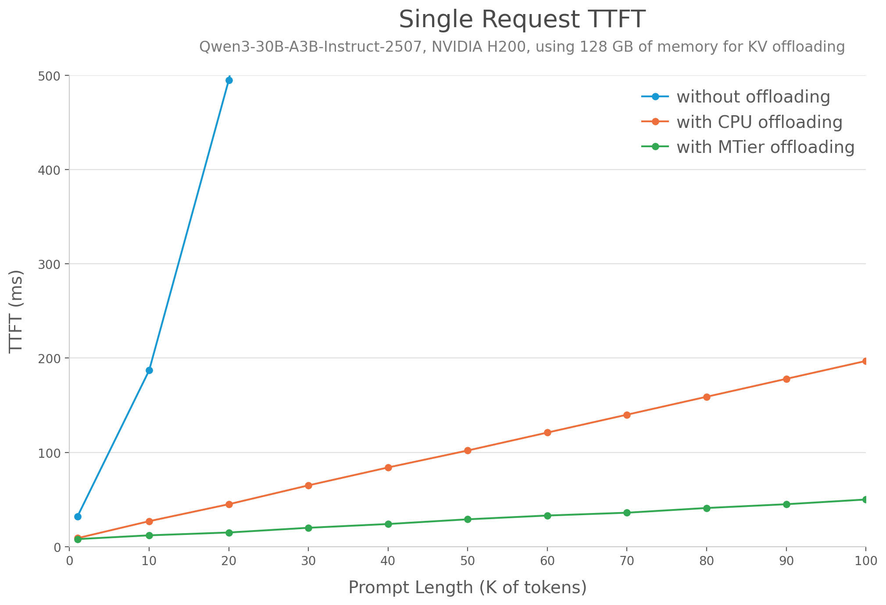
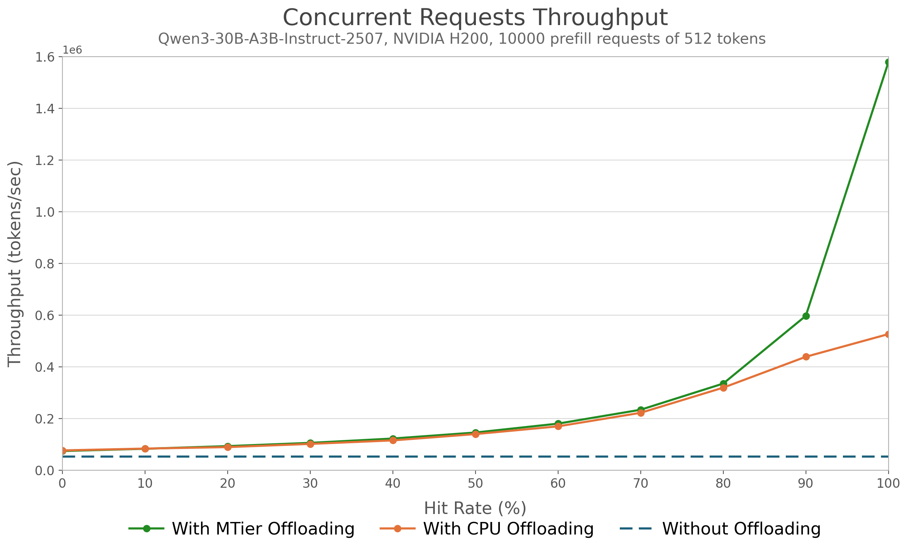

<!-- markdownlint-disable MD001 MD041 -->
<p align="center">
  
  <picture>
    <source media="(prefers-color-scheme: dark)" srcset="https://raw.githubusercontent.com/vllm-project/vllm/main/docs/assets/logos/vllm-logo-text-dark.png">
    
  </picture>
  
</p>

<h3 align="center">
vLLM meets Netpreme's scale-up GPU memory expansion </h3>

🔥 We have built a prototype platform to enable developers and researchers to explore the use cases of scale-up GPU memory expansion. Please [contact](https://netpreme.com/developer) us to get access to it. 

---

## About
This repository is a fork of vLLM that integrates Netpreme’s scale-up GPU memory expansion system, X-Mem, as a dedicated tier for KV cache storage. By replacing traditional CPU DRAM with X-Mem in the KV offloading module, we leverage ~10x higher bandwidth to bypass standard memory bottlenecks. This allows an inference engine to reduce Time to First Token (TTFT) and achieve higher throughput and concurrency for KV-intensive workloads, such as multi-turn coding agents.

## Getting Started
Install vLLM+X-Mem from source

```bash
uv venv --python 3.12
git clone <url-to-repo>
cd vllm_xmem
uv pip install -e .
```

> [!NOTE]
> vLLM+X-Mem will only work on Netpreme's X-Mem VMs. Please [contact](https://netpreme.com/developer) us to get access to it.

## Usage

To replace CPU DRAM with X-Mem,
* `vllm serve` CLI API: add `--kv-offloading-mtier` flag
* `LLM()` Python API: set the `kv_offload_mtier` argument to `True`.   
  e.g.,
  ```python
  ktc = KVTransferConfig(
    kv_connector="OffloadingConnector",
    kv_role="kv_both",
    # The below config will be applied to X-Mem 
    #   instead of CPU DRAM if X-Mem is enabled
    kv_connector_extra_config={
        "block_size": CPU_BLOCK_SIZE,
        "cpu_bytes_to_use": cpu_bytes_to_use,
        "num_cpu_blocks": num_cpu_blocks, 
    }
  )
  llm = LLM(
      model=MODEL,
      block_size=GPU_BLOCK_SIZE,
      ...
      enable_prefix_caching=True,
      kv_transfer_config=ktc,
      kv_offload_mtier=True,
  )
  ```
---
## 📊 Performance Benchmarks

We evaluated the integration of X-Mem into vLLM's KV offload connector, comparing it against a CPU DRAM baseline. We used the benchmark code used in the vLLM blog post on KV offloading ([blog](https://vllm.ai/blog/kv-offloading-connector), [code](https://github.com/orozery/playground/blob/kv-offloading-blog-dec-2025/kvcache/kv_offload_benchmark.py)). 

### Setup
  * Hardware: Single H200 GPU with 128GB of dedicated KV offloading memory (either Host DRAM or X-Mem).
  * Model: Qwen3-30B-A3B-Instruct-2507 (96 KB per-token KV cache).
  * Configuration: GPU KV cache disabled (to isolate offloading), block size = 128 tokens, 10000 prefill requests of 512 tokens are used for the throughput experiment.

### Key Results

X-Mem shows significant gains over CPU DRAM for high cache-hit rate workloads, where data copying dominates computation:

* 🚀 Time to First Token (TTFT): ~4× faster than CPU DRAM.

* ⚡ Throughput: ~3× higher input token throughput.


### Running the benchmark script
To reprodcue results, we provide the benchmark script (`kvcache_benchmark.py`) based on the benchmark used in the vLLM blog ([blog](https://vllm.ai/blog/kv-offloading-connector), [code](https://github.com/orozery/playground/blob/kv-offloading-blog-dec-2025/kvcache/kv_offload_benchmark.py)).
* TTFT: `python kvcache_benchmark.py --ttft`
* throughput: `python kvcache_benchmark.py --tput`


## Roadmap

* Optimize implementation to close the gap with the ~450 GB/s theoretical bandwidth limit.
* Expand benchmark across various block sizes and prompt lengths.
* Benchmark using production traces (e.g., Mooncake Trace) with the GPU KV cache enabled to represent real-world workloads.
