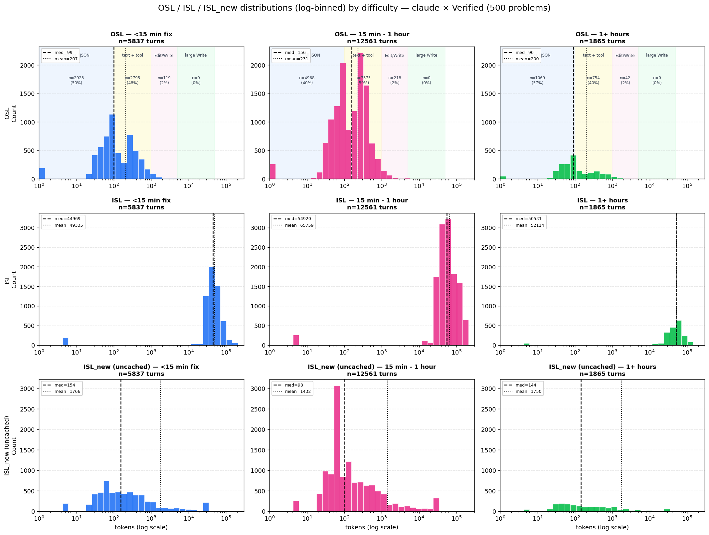

# ISL/OSL distribition generation

Measures the input and output sequence length (ISL / OSL) distributions of a
real coding agent. Claude Code drives a model — local via vLLM, or hosted via
the Anthropic API — through SWE-bench Verified problems, and a logging proxy
records ISL/OSL plus cache and timing on every turn. Single-GPU setup
(1× NVIDIA GPU) required.

## Setup

Harness:    Claude Code

Server:     vLLM

Model:      [Qwen/Qwen3-Coder-30B-A3B-Instruct-FP8](https://huggingface.co/Qwen/Qwen3-Coder-30B-A3B-Instruct-FP8)

Dataset:    [SWE Bench Verified](https://huggingface.co/datasets/princeton-nlp/SWE-bench_Verified)

## System design

```
   ┌──────────────────────┐
   │   SWE-bench problem  │   GitHub repo cloned locally @ base_commit,
   │   (Verified / Pro)   │   used as the sandbox repo
   └──────────┬───────────┘
              │ problem statement
              ▼
   ┌──────────────────────┐
   │     Claude Code      │   coding agent: reads files, edits, runs tests,
   │   (claude -p prompt) │   loops tool calls until the bug is fixed
   └──────────┬───────────┘
              │ many turns of /v1/messages, each carrying
              │   prompt history + tool results
              ▼
   ┌──────────────────────┐   tap captures, per turn:
   │  measurement tap     │   ISL, OSL, ISL_new, ISL_cached,
   │  (logging proxy)     │   cache_hit_rate, ttft_ms, decode_ms,
   └──────────┬───────────┘   itl_ms, category (text / tool / mixed)
              │ forwards request unchanged
              ▼
   ┌─────────────────────────────────────────┐
   │              Model server               │
   │  ┌─────────────────┐  ┌───────────────┐ │
   │  │  vLLM (local)   │  │ Anthropic API │ │
   │  │  Qwen3-Coder    │  │ Claude Opus   │ │
   │  └─────────────────┘  └───────────────┘ │
   └─────────────────────────────────────────┘
              │ response streamed back through the proxy to claude
              ▼
   ┌──────────────────────┐
   │   per-turn CSV +     │   analyze.sh → distribution / cache /
   │   per-problem JSON   │   TTFT-prefill / ITL-decode figures
   └──────────────────────┘
```

What gets saved per run (`runs/<stamp>/`):

- `config.json` — resolved config (model, dataset, caps, machine)
- `problems.jsonl` — the SWE-bench rows fed to claude
- `per_problem/<id>.csv` — one row per assistant turn (the proxy log)
- `per_problem/<id>.summary.json` — per-problem totals from claude's `result` event
- `solved.txt` — completed instance IDs
- `analysis/*.png` — figures from `analyze.sh`

## Quick start

```bash
# Local vLLM (Qwen3-Coder) — start the server, then run:
bash ../server.sh > /tmp/vllm.log 2>&1 &
./run.sh                                            # claude code + vllm + swe bench verfied
./analyze.sh runs/<stamp>                           # generate figures
```

To run SWE-bench Pro, use:

```bash
bash ../server.sh > /tmp/vllm.log 2>&1 &
./run.sh --dataset pro
./analyze.sh runs/<stamp>
```

To use the hosted Anthropic API (no local vLLM needed; uses your existing
`claude login` credentials), use:

```bash
./run.sh --backend anthropic --model claude-opus-4-7
./analyze.sh runs/<stamp>
```

## Results



`analysis_dist_grid.png` — Per-turn token counts as histograms, split by
SWE-bench difficulty bucket (`<15min`, `15min–1h`, `1+h`). Rows are
`ISL` (total prompt), `ISL_new` (non-cached portion), and `OSL` (output).
**Takeaways:** OSL is heavily concentrated below ~200 tokens regardless of
difficulty (tool-call outputs dominate over long-form text); ISL has a
heavy right tail above 100k tokens; harder problems drift to larger ISL.


`analysis_cache.png` — Cache-hit-rate trajectory per turn, by difficulty.
Turn 1 (always 0% cold-start) and auto-compaction turns (`cache_hit < 50%`
AND `isl_new > 50k` — the ~143k full-recompute events) are excluded from
both the per-turn line and the aggregate distribution. y-axis clipped to
60–100%. **Takeaways:** from turn 2 onward, cache hit is already ~75–85%
and climbs to 95–98% steady-state by turn ~5 for all difficulty buckets.
Harder problems just run for many more turns at that steady state.


