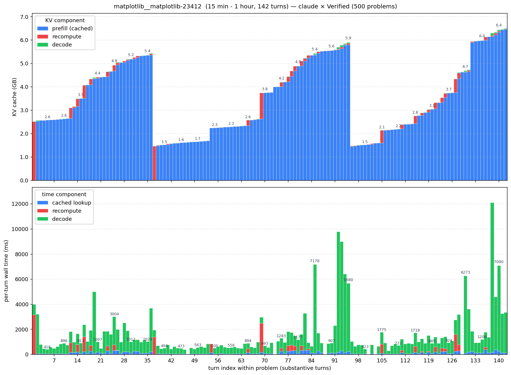

# Coding Agent ISL/OSL distribution

Our goal is to obtain the ISL, OSL, ISL_new (uncached tokens) using claude code and a real coding task. We use SWE Bench Verified as the dataset.

Simulating a single coding agent run in an isolated environment, coding problems are solved one at a time. Per-turn metrics are collected - inference metrics from GPUs from vLLM and harness metrics from coding agents. The full list is shown below.

**Inference metrics — from vLLM's `/metrics` Prometheus endpoint**:

| field | unit | meaning |
|---|---|---|
| `isl` | tokens | input sequence length: prompt tokens fed to the model this turn |
| `osl` | tokens | output sequence length: generated tokens this turn |
| `isl_new` | tokens | uncached input tokens that actually went through prefill compute |
| `isl_cached` | tokens | input tokens reused from the prefix cache (`isl − isl_new`) |
| `cache_hit_rate` | 0-1 | `isl_cached / isl` |
| `ttft_ms` | ms | time-to-first-token (reconstructed as `queue + prefill`) |
| `prefill_ms` | ms | scheduler time spent prefilling this request |
| `decode_ms` | ms | scheduler time spent decoding this request |
| `itl_ms` | ms/tok | mean inter-token latency during decode |
| `queue_ms` | ms | scheduler queue wait before prefill (~0 at concurrency=1) |
| `kv_cache_usage_pct` | % | GPU KV-cache utilization gauge at end of turn |
| `stop_reason` | enum | `stop` / `length` / `abort` / `error` / `repetition` |

**Harness metrics**:

| field | meaning |
|---|---|
| `agent` | `main` (claude's outer loop, ~27 k char system prompt) or `sub` (Task-tool sub-agent, ~3 k char system prompt) |
| `num_tool_defs` | number of tool schemas claude shipped in the request |
| `num_messages` | length of the `messages` array |
| `system_prompt_chars` | raw character count of the system prompt (signal for main/sub classification) |

**Orchestration metadata**:

| field | meaning |
|---|---|
| `instance_id` | SWE-bench problem id (e.g. `astropy__astropy-12907`) |
| `difficulty` | `<15 min fix` / `15 min - 1 hour` / `1+ hours` |
| `turn` | 1-indexed turn number within the problem |
| `ts` | wall-clock timestamp of the watcher's "before" scrape |
| `elapsed_ms` | wall-clock between bracketing scrapes (proxy for e2e turn latency) |
| `prefix_kv_tokens` | `isl + osl` of the previous turn (max possible cache reuse this turn) |
| `usable_prefix_kv_tokens` | `cache_hit_rate × prefix_kv_tokens` |
| `kv_cache_used_bytes` | `isl_cached × 96 KB/tok` |


## How to run

```bash
bash ../server.sh > /tmp/vllm.log 2>&1 &      # start vLLM (initial boot)
./run.py                                      # all 500 SWE-bench Verified problems
./analyze.sh runs/<stamp>                     # (run.py already calls this; only re-run if you tweak plots)
```

To swap the served model, pass the flags to `run.py` — between problems
`reset_vllm.sh` relaunches the server, picking up the overridden env vars:

```bash
# Qwen3-Coder
./run.py --model Qwen/Qwen3-Coder-30B-A3B-Instruct-FP8 --tool-call-parser qwen3_coder

# GPT-OSS 120B
./run.py --model openai/gpt-oss-120b --tool-call-parser gpt_oss
```

`run.py` flags:

| flag | default | meaning |
|---|---|---|
| `--limit N`                    | 500   | use the first `N` problems |
| `--random N --seed S`          | —     | random sample of `N` problems (overrides `--limit`) |
| `--model HF_ID`                | `Qwen/Qwen3-Coder-30B-A3B-Instruct-FP8` | model id; what claude sends AND what vLLM serves |
| `--tool-call-parser NAME`      | `qwen3_coder` | vLLM's tool-call parser. Must match the model family (`qwen3_coder` for Qwen, `gpt_oss` for GPT-OSS, `hermes` / `mistral` / `llama3_json` for others) |
| `--tensor-parallel-size N`     | `1`   | vLLM `--tensor-parallel-size` (bump for multi-GPU) |
| `--max-model-len N`            | `262144` | vLLM `--max-model-len`; cap is the model's `max_position_embeddings` |
| `--gpu-memory-utilization F`   | `0.90` | vLLM `--gpu-memory-utilization` (0-1) |

All vLLM-side flags are exported as env vars before `reset_vllm.sh` runs, so the cold-restarted server picks them up. The same vars can also be set in `../.env`; CLI flags win over `.env` defaults.


## Setup

| | |
|---|---|
| Harness | Claude Code |
| Server  | vLLM |
| Model   | [Qwen/Qwen3-Coder-30B-A3B-Instruct-FP8](https://huggingface.co/Qwen/Qwen3-Coder-30B-A3B-Instruct-FP8) |
| Dataset | [SWE Bench Verified](https://huggingface.co/datasets/princeton-nlp/SWE-bench_Verified) |


## System design

```
   ┌──────────────────────┐
   │   SWE-bench problem  │   GitHub repo cloned locally @ base_commit
   └──────────┬───────────┘
              │ problem statement
              ▼
   ┌──────────────────────┐
   │     Claude Code      │   reads files, edits, runs tests,
   │   (claude -p prompt) │   loops tool calls until the bug is fixed
   └──────────┬───────────┘
              │ POSTs /v1/messages, one per turn
              ▼
   ┌──────────────────────┐
   │   agent_labeler      │   classify main vs sub from system-prompt size →
   │   (reverse proxy)    │   append record to .agent_labels (FIFO queue)
   └──────────┬───────────┘
              │ forwards unmodified
              ▼
   ┌──────────────────────┐
   │  vLLM (Qwen3-Coder)  │ ────────► /metrics  (Prometheus endpoint)
   └──────────────────────┘               ▲
              │ response streamed         │ scraped every 100 ms
              ▼                           │
   ┌──────────────────────┐         ┌─────┴────────────────────┐
   │      claude-cli      │         │   metrics_watcher        │
   │  (next turn, repeat) │         │   on each completion:    │
   └──────────────────────┘         │     · pop one label      │
                                    │     · merge with vLLM    │
                                    │       counter deltas     │
                                    │     · write CSV row      │
                                    └──────────────────────────┘
                                                  │
                                                  ▼
                                     analyze.sh ─► data.npz + figures
```


## Per-run output (`runs/<stamp>/`)

- `config.json`, `problems.jsonl`, `solved.txt`
- `per_problem/<id>.csv` — one row per assistant turn (watcher's output)
- `per_problem/<id>.summary.json` — per-problem totals from claude's `result` event
- `.active_instance`, `.agent_labels` — control + label-queue files
- `.labeler.log`, `.watcher.log` — sidecar stderr
- `data.npz` — canonical per-turn array (built by `analyze.sh`)
- `analysis/*.png` — figures


## Results


`analysis_dist_agg.png` — OSL / ISL / ISL_uncached histograms across all 500 problems. OSL is bucketed into `tool calls / plan / code edits`; ISL_uncached into `small tool result / file read / large read / system prompt or compaction`. ISL panel marks the claude-code baseline (~27k tokens) as a red reference line.


`analysis_cache.png` — Cache-hit-rate trajectory per turn, by difficulty. Turn 1 (cold-start) and auto-compaction turns (`cache_hit < 50%` AND `isl_new > 50k`) excluded. From turn 2 onward, cache hit is already 75–85% and climbs to 95–98% steady-state by turn ~5. Harder problems just run for more turns at that steady state.


`analysis_turns.png` — distribution of turns-per-problem. Median 29 overall, monotone shift by difficulty (`<15min` median 26 → `15min–1h` median 30 → `1+h` median 34). Long tail reaches 471 turns.



`samples/kv_matplotlib__matplotlib-23412.png` — example per-turn breakdown for one representative problem. **Top**: KV cache (GB) — blue cached, red recompute, green decode. **Bottom**: per-turn wall time, decomposed the same way.
