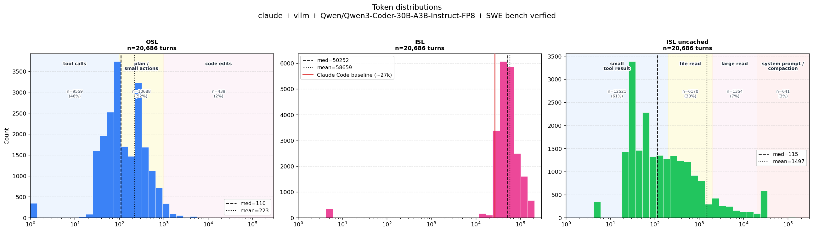
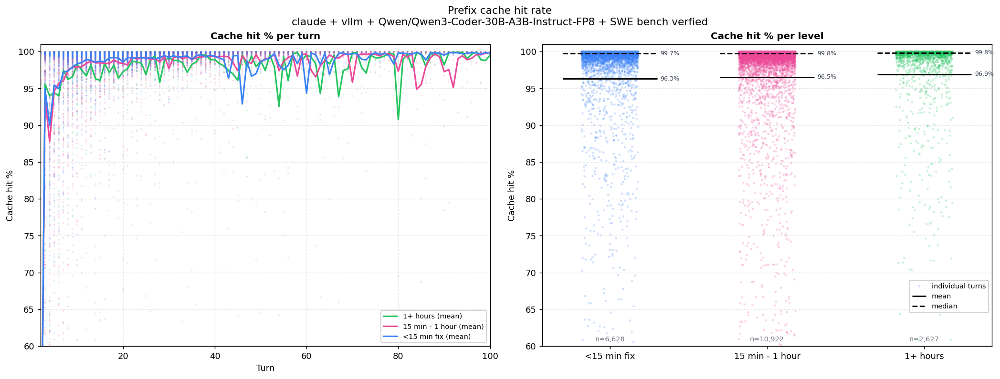
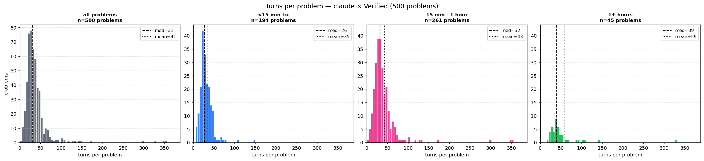
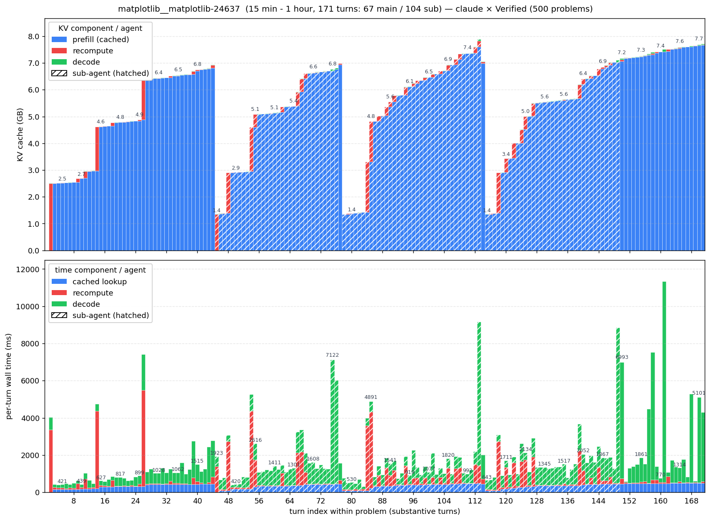

# ISL/OSL distribition generation

Measures the input and output sequence length (ISL / OSL) distributions of a
real coding agent. Claude Code drives a local vLLM server through SWE-bench
Verified problems; a background watcher polls vLLM's Prometheus `/metrics`
endpoint and writes one row per turn with ISL / OSL / cache hits / TTFT /
prefill / decode / ITL / queue / KV-usage. Single-GPU setup (1× NVIDIA GPU)
required.

## Setup

Harness:    Claude Code

Server:     vLLM

Model:      [Qwen/Qwen3-Coder-30B-A3B-Instruct-FP8](https://huggingface.co/Qwen/Qwen3-Coder-30B-A3B-Instruct-FP8)

Dataset:    [SWE Bench Verified](https://huggingface.co/datasets/princeton-nlp/SWE-bench_Verified)

## System design

```
   ┌──────────────────────┐
   │   SWE-bench problem  │   GitHub repo cloned locally @ base_commit,
   │   (Verified / Pro)   │   used as the sandbox repo
   └──────────┬───────────┘
              │ problem statement
              ▼
   ┌──────────────────────┐
   │     Claude Code      │   coding agent: reads files, edits, runs tests,
   │   (claude -p prompt) │   loops tool calls until the bug is fixed
   └──────────┬───────────┘
              │ POSTs /v1/messages straight to vLLM, one per turn
              ▼
   ┌──────────────────────┐
   │  vLLM (Qwen3-Coder)  │   ─────────►  /metrics  (Prometheus endpoint)
   └──────────────────────┘                  ▲
              │ response streamed             │ scraped every 100 ms
              ▼                               │
   ┌──────────────────────┐                   │
   │      claude-cli      │              ┌────┴───────────────┐
   │  (next turn, repeat) │              │  metrics_watcher   │
   └──────────────────────┘              │  detects each turn │
                                          │  completion in     │
                                          │  the counters and  │
                                          │  writes one row    │
                                          │  per turn to       │
                                          │  per_problem/*.csv │
                                          └────────────────────┘
                                                    │
                                                    ▼
                                         analyze.sh ─► data.npz + figures
```

The watcher reads vLLM's per-request histograms (`vllm:request_prompt_tokens_sum`,
`vllm:request_prefill_time_seconds_sum`, etc.). At concurrency=1, vLLM updates
all of those atomically at request completion, so the delta between two
scrapes that bracket one completion is exactly that request's contribution —
giving us per-turn attribution without an intercepting proxy.

What gets saved per run (`runs/<stamp>/`):

- `config.json` — resolved config (model, dataset, caps, machine)
- `problems.jsonl` — the SWE-bench rows fed to claude
- `per_problem/<id>.csv` — one row per assistant turn (the watcher's output)
- `per_problem/<id>.summary.json` — per-problem totals from claude's `result` event
- `solved.txt` — completed instance IDs
- `.active_instance` — control file the watcher reads to attribute rows
- `.watcher.log` — watcher's stderr (mostly empty; vLLM-restart noise filtered)
- `data.npz` — canonical per-turn structured array (built by `analyze.sh`)
- `analysis/*.png` — figures from `analyze.sh` (all read from `data.npz`)

## Quick start

```bash
# Start the vLLM server (Qwen3-Coder), then drive a SWE-bench run:
bash ../server.sh > /tmp/vllm.log 2>&1 &
./run.sh                                            # Verified, all 500 problems
./analyze.sh runs/<stamp>                           # build data.npz + figures
```

Other dataset / sample sizes:

```bash
./run.sh --dataset pro                              # SWE-bench Pro instead
./run.sh --limit 50                                 # first 50 problems
./run.sh --random 100 --seed 0                      # random sample of 100
./run.sh --no-analysis                              # skip analyze.sh at the end
```

## Results



`analysis_dist_agg.png` — Same three histograms collapsed across all 500
problems (no difficulty split). Same semantic region bands as the grid
version: OSL is bucketed into `tool calls / plan / code edits` and
ISL_uncached into `small tool result / file read / large read /
system prompt or compaction`. ISL panel marks the **claude-code
baseline** (~27k tokens total — system prompt ~6.4k + 28 tool schemas ~19.5k +
task statement) as a red reference line.



`analysis_cache.png` — Cache-hit-rate trajectory per turn, by difficulty.
Turn 1 (always 0% cold-start) and auto-compaction turns (`cache_hit < 50%`
AND `isl_new > 50k` — the ~143k full-recompute events) are excluded from
both the per-turn line and the aggregate distribution. y-axis clipped to
60–100%. **Takeaways:** from turn 2 onward, cache hit is already ~75–85%
and climbs to 95–98% steady-state by turn ~5 for all difficulty buckets.
Harder problems just run for many more turns at that steady state.



`analysis_turns.png` — distribution of turns-per-problem (substantive turns
only; empty/init rows dropped). Leftmost panel aggregates all 500 problems;
the next three split by difficulty with a shared y-axis for direct
comparison. **Takeaways:** median ~31 turns/problem overall, with a clear
monotone shift by difficulty (`<15min` median 26 → `15min–1h` median 32 →
`1+h` median 39). One outlier at 618 turns lives in the easy bucket
(probably a loop the model couldn't escape).



`samples/kv_matplotlib__matplotlib-24637.png` — example per-turn breakdown
for one representative problem (171 turns). **Top panel**: stacked KV cache
in GB per turn — blue (cached prefix reused), red (recompute), green
(decode). **Bottom panel**: per-turn wall time in ms, decomposed the same
way. **Hatched bars** mark Task-tool sub-agent turns; solid bars are the main agent. 
