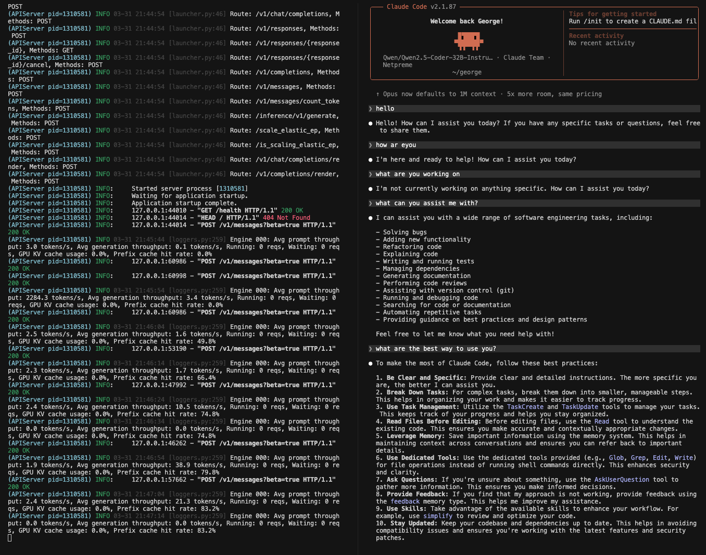

Running vllm server and client making requests

To make a chat

On separate processes, 
`./launch_vllm.sh`
`./infer_chat.sh`

---

To run conversation

set env to 

```
MODEL=Qwen/Qwen2.5-Coder-32B-Instruct
HOST=0.0.0.0
PORT=8000
TENSOR_PARALLEL_SIZE=1
DTYPE=auto
# MAX_MODEL_LEN=65536
GPU_MEMORY_UTILIZATION=0.90
CUDA_VISIBLE_DEVICES=7

```
`./launch_vllm.sh`
`./infer_conversation.sh`

vllm_xmem) cloud-user@gpu-h100-29:~/george/vllm_xmem$ bash '/home/cloud-user/george/vllm_xmem/prefix_caching/anthropic/infer_conversation.sh'
Multi-turn conversation (prefix caching enabled on server).
Type your message and press Enter. Ctrl-D or 'exit' to quit.
---

[you]: hello

[assistant]: Hello! How can I assist you today?

  ┌─ Request Tokens ─────────────────────────────────────────────
  │ Input tokens (this request):  30
  │ Output tokens (this request): 10
  ├─ Prefix Cache (cumulative, all requests) ────────────────────
  │ Queried tokens:               30.0
  │ Cache hit tokens:             0.0
  │ Cache hit rate:               0.0%
  │ KV cache reads  (from cache): 0.0 tokens
  │ KV cache writes (to cache):   30 tokens
  ├─ KV Cache Pool ──────────────────────────────────────────────
  │ Total GPU blocks:             1982 (block_size=16 tokens)
  │ Max token capacity:           31712
  └──────────────────────────────────────────────────────────────

[you]: hello

[assistant]: Hello again! Is there something specific you'd like to talk about or ask?

  ┌─ Request Tokens ─────────────────────────────────────────────
  │ Input tokens (this request):  50
  │ Output tokens (this request): 17
  ├─ Prefix Cache (cumulative, all requests) ────────────────────
  │ Queried tokens:               80.0
  │ Cache hit tokens:             32.0
  │ Cache hit rate:               40.0%
  │ KV cache reads  (from cache): 32.0 tokens
  │ KV cache writes (to cache):   48 tokens
  ├─ KV Cache Pool ──────────────────────────────────────────────
  │ Total GPU blocks:             1982 (block_size=16 tokens)
  │ Max token capacity:           31712
  └──────────────────────────────────────────────────────────────

[you]: hello

[assistant]: Hello! It seems you're saying hello quite a bit today. How can I assist you? Do you have any questions or topics you'd like to discuss?

  ┌─ Request Tokens ─────────────────────────────────────────────
  │ Input tokens (this request):  77
  │ Output tokens (this request): 33
  ├─ Prefix Cache (cumulative, all requests) ────────────────────
  │ Queried tokens:               157.0
  │ Cache hit tokens:             96.0
  │ Cache hit rate:               61.1%
  │ KV cache reads  (from cache): 96.0 tokens
  │ KV cache writes (to cache):   61 tokens
  ├─ KV Cache Pool ──────────────────────────────────────────────
  │ Total GPU blocks:             1982 (block_size=16 tokens)
  │ Max token capacity:           31712
  └──────────────────────────────────────────────────────────────

[you]: hello

[assistant]: Hello! It looks like you're quite friendly today. How can I assist you? Do you have any questions or topics you'd like to discuss?

  ┌─ Request Tokens ─────────────────────────────────────────────
  │ Input tokens (this request):  120
  │ Output tokens (this request): 31
  ├─ Prefix Cache (cumulative, all requests) ────────────────────
  │ Queried tokens:               277.0
  │ Cache hit tokens:             192.0
  │ Cache hit rate:               69.3%
  │ KV cache reads  (from cache): 192.0 tokens
  │ KV cache writes (to cache):   85 tokens
  ├─ KV Cache Pool ──────────────────────────────────────────────
  │ Total GPU blocks:             1982 (block_size=16 tokens)
  │ Max token capacity:           31712
  └──────────────────────────────────────────────────────────────

Note that we are using blocks of 16. Anything that is not inside the full block will not be cached and will be recomputed. Hence, not all generated tokens will be used as prefix cache in the next turn
Note that in turn one, there is the input prompt + system prompt. In the next turn there is previous prompts + assistant prompt + whatever, each turn is not just the user prompt. 

---

Running claude code on the GPU machine

```
MODEL=Qwen/Qwen2.5-Coder-32B-Instruct
HOST=0.0.0.0
PORT=8000
TENSOR_PARALLEL_SIZE=2
DTYPE=auto
MAX_MODEL_LEN=65536
GPU_MEMORY_UTILIZATION=0.90
CUDA_VISIBLE_DEVICES=6,7
```

`./launch_vllm.sh`
`./run_claude_local.sh`
`./watch_cache.sh 1`



### Notes

- Anthropic uses the `/messages` API, not the OpenAI `/chat/completions` for Claude Code
- vLLM pre-allocates the entire KV cache pool at startup (`--gpu-memory-utilization`), so `nvidia-smi` memory stays constant
- `GPU KV cache usage` in vLLM logs only counts blocks actively held by running requests (`ref_cnt > 0`), not idle cached blocks
- Prefix-cached blocks sit in the free queue with their KV data intact until evicted; they are reused on hash match

### KV Cache Sizing (Qwen2.5-32B, BF16)

```
Per token = 64 layers x 8 KV heads x 128 head dim x 2 (K+V) x 2 bytes = 256 KB
Per block = 16 tokens x 256 KB = 4 MB
Total pool = 18,562 blocks x 4 MB = ~72.5 GB  (capacity: 296,992 tokens)
```

### GPU Memory Breakdown (2x H100, 90% utilization)

| | Per GPU | 2x H100 |
|---|---|---|
| Total HBM | 81,559 MiB | ~160 GB |
| 90% allocation | ~73,400 MiB | ~143 GB |
| Model weights (32B, BF16) | ~32 GB | ~64 GB |
| Remaining for KV cache | | ~79 GB |
| Actual KV cache allocated | | ~72.5 GB |

### Verifying KV Cache Usage

On one turn, vLLM reported `GPU KV cache usage: 8.4%` and `Prefix cache hit rate: 74.9%`:

```
(APIServer pid=1618555) INFO 04-01 15:42:26 [loggers.py:259] Engine 000: Avg prompt throughput: 2.5 tokens/s,
Avg generation throughput: 3.2 tokens/s, Running: 1 reqs, Waiting: 0 reqs,
GPU KV cache usage: 8.4%, Prefix cache hit rate: 74.9%
```

`watch_cache.sh` metrics (from Prometheus) for that same turn:

```
┌─ This Turn ───────────────────────────────────────────────
│ Input tokens queried:          24,761
│ KV cache reads  (from cache):  24,736 tokens
│ KV cache writes (to cache):    25 tokens
│ Turn hit rate:                 99.9%
├─ Cumulative (all requests) ───────────────────────────────
│ Total queried tokens:          97,680
│ Total cache hit tokens:        73,184
│ Total cache write tokens:      24,496
│ Overall hit rate:              74.9%
├─ KV Cache Pool ───────────────────────────────────────────
│ Total GPU blocks:              18,562 (block_size=16 tokens)
│ Max token capacity:            296,992
└──────────────────────────────────────────────────────────
```

The 74.9% overall hit rate matches the vLLM log. The 8.4% KV cache usage verified two ways:

**Byte-level:**
```
24,000 active tokens x 256 KB/token = 6 GB used
72.5 GB total pool
6 / 72.5 = 8.3%
```

**Token-level:**
```
~24K active tokens / 296,992 max capacity = 8.1%
```

Both confirm the 8.4% reported by vLLM.

Claude Code sends ~24K tokens per request (system prompt + CLAUDE.md + conversation history).
Each turn gets 99.9% hit rate — only ~25-30 new tokens need compute.
The overall hit rate (74.9%) is lower because it includes the cold-start first request where nothing was cached, and asymptotically approaches 99.9% over more turns.

---

Appendix: Claude Code with local Dynamo + vLLM

This adds a second path for running Claude Code against the local open-source model stack in `./_dynamo/`.

## System Design

```text
Claude Code CLI
  -> ANTHROPIC_BASE_URL=http://localhost:8000
  -> Dynamo frontend (`python3 -m dynamo.frontend`)
  -> vLLM worker (`python3 -m dynamo.vllm`)
  -> vLLM EngineCore
  -> KV cache on GPUs 6 and 7
```

The frontend speaks Anthropic's `/v1/messages` API directly, so Claude Code does not need LiteLLM or any other translation layer. The worker uses file-based discovery, which keeps this setup single-node and self-contained.

Claude Code also injects a per-request attribution header into the system prompt by default. That header changes a small part of the prompt on every request, and prefix caching only works when the token prefix is identical. So even if the conversation history is the same, the prompt no longer starts with the same token blocks, and the cache misses. For this Dynamo setup, we disable that header with `CLAUDE_CODE_ATTRIBUTION_HEADER=0`. When only vLLM is used with claude code, this header is automatically removed. However, when using Dynamo, claude code sends the info to dynamo, and the information is kept. This header changes per request. 

Example:

Without the env var:

```text
Turn 1:
system: "You are a helpful assistant."
system: "x-anthropic-billing-header: cc_version=...; cc_entrypoint=cli;"
user: "hello"

Turn 2:
system: "You are a helpful assistant."
system: "x-anthropic-billing-header: cc_version=...different...; cc_entrypoint=cli;"
user: "hello"
assistant: "Hi"
user: "hello again"
```

The second turn does not begin with the same tokens, so the prefix cache cannot reuse the earlier blocks.

With the env var:

```text
Turn 1:
system: "You are a helpful assistant."
user: "hello"

Turn 2:
system: "You are a helpful assistant."
user: "hello"
assistant: "Hi"
user: "hello again"
```

Now the shared prefix is stable, so vLLM can match the same cached token blocks again.

## What It Uses

- Model: `Qwen/Qwen2.5-Coder-32B-Instruct`
- GPUs: `CUDA_VISIBLE_DEVICES=6,7`
- Tensor parallel size: `2`
- Max model length: `65536`
- GPU memory utilization: `0.90`
- Port: `8000`
- Prefix caching: enabled on the vLLM worker

## Claude Code Run

1. Start the stack:

   ```bash
   cd /home/cloud-user/george/vllm_xmem/prefix_caching/anthropic/_dynamo
   ./launch_dynamo.sh
   ```

2. In a second terminal, launch Claude Code against the local endpoint:

   ```bash
   CLAUDE_CODE_ATTRIBUTION_HEADER=0 ./run_claude_local.sh
   ```

3. Optional: watch prefix-cache metrics while you chat:

   ```bash
   ./watch_cache.sh 1
   ```

## Environment

Both Dynamo scripts load `./_dynamo/.env` first. The default values are:

```bash
MODEL=Qwen/Qwen2.5-Coder-32B-Instruct
DYNAMO_PORT=8000
TENSOR_PARALLEL_SIZE=2
DTYPE=auto
MAX_MODEL_LEN=65536
GPU_MEMORY_UTILIZATION=0.90
CUDA_VISIBLE_DEVICES=6,7
CLAUDE_CODE_ATTRIBUTION_HEADER=0
```

You can override any of them with environment variables before launching.

## Notes

- `launch_dynamo.sh` starts both the Dynamo frontend and the vLLM worker.
- `run_claude_local.sh` waits for `/health`, checks `/v1/models`, and then starts `claude --model ...`.
- `ANTHROPIC_API_KEY=dummy` is intentional for this local setup.
- `CLAUDE_CODE_ATTRIBUTION_HEADER=0` removes Claude Code's per-request billing header from the system prompt, which keeps the prompt prefix stable enough for prefix caching to hit.
- Logs are written to `/tmp/dynamo_worker.log` and `/tmp/dynamo_frontend.log`.
- Prefix caching is enabled on the worker, but the observed hit rate depends on how the request prefix is tokenized across turns.
